# SOC Detection Engineering Lab – Scheduled Task Detection (MITRE ATT&CK T1053.005)


## Overview

This project demonstrates an end-to-end Security Operations Center (SOC) workflow for detecting Scheduled Task creation activity using Sysmon, Wazuh, OpenSearch, and DFIR-IRIS.

The lab validates detection coverage for MITRE ATT&CK technique T1053.005 (Scheduled Task) through both malicious simulation and benign administrative activity.

The objective is to demonstrate how endpoint telemetry can be transformed into actionable security detections while reducing false positives through analyst investigation and incident response workflows.

---

# Lab Environment

| Component                  | Description                    |
| -------------------------- | ------------------------------ |
| Windows 10 Enterprise LTSC | Target Endpoint                |
| Sysmon                     | Endpoint Telemetry Collection  |
| Wazuh Agent                | Log Forwarding                 |
| Wazuh Manager              | SIEM & Detection Engine        |
| OpenSearch Dashboard       | Threat Hunting & Visualization |
| DFIR-IRIS                  | Incident Response Platform     |
| Atomic Red Team            | Attack Simulation Framework    |

---

# Architecture


---

# Attack Simulation

The attack simulation was performed using Atomic Red Team to emulate Scheduled Task creation behavior associated with MITRE ATT&CK Technique T1053.005.

### Technique Information

| Field          | Value                                        |
| -------------- | -------------------------------------------- |
| Technique ID   | T1053.005                                    |
| Technique Name | Scheduled Task                               |
| Tactic         | Execution, Persistence, Privilege Escalation |

Atomic Red Team was used to create Scheduled Tasks that execute commands automatically at startup and user logon.

### Test Execution

```powershell
Invoke-AtomicTest T1053.005 -TestNumbers 1
```

Example generated command:

```text
schtasks /create /tn "T1053_005_OnStartup" /sc onstart /ru system /tr "cmd.exe /c calc.exe"
```

This behavior is commonly abused by threat actors to establish persistence and execute payloads automatically after reboot or user logon.

## Screenshot

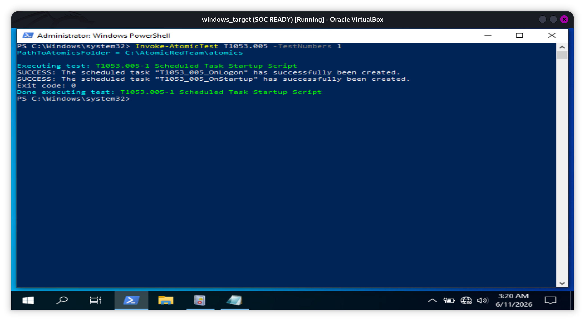

---

# Sysmon Telemetry Collection

Sysmon Event ID 1 (Process Creation) successfully captured Scheduled Task creation activity.

Observed telemetry included:

* Process Image
* Parent Process
* Command Line
* Process GUID
* User Context
* Integrity Level
* File Hashes

Observed Process:

```text
C:\Windows\System32\schtasks.exe
```

Observed Command Line:

```text
schtasks /create /tn "T1053_005_OnStartup" /sc onstart /ru system /tr "cmd.exe /c calc.exe"
```

Sysmon provided detailed visibility into process execution activity that became the primary telemetry source for the detection workflow.

## Screenshot

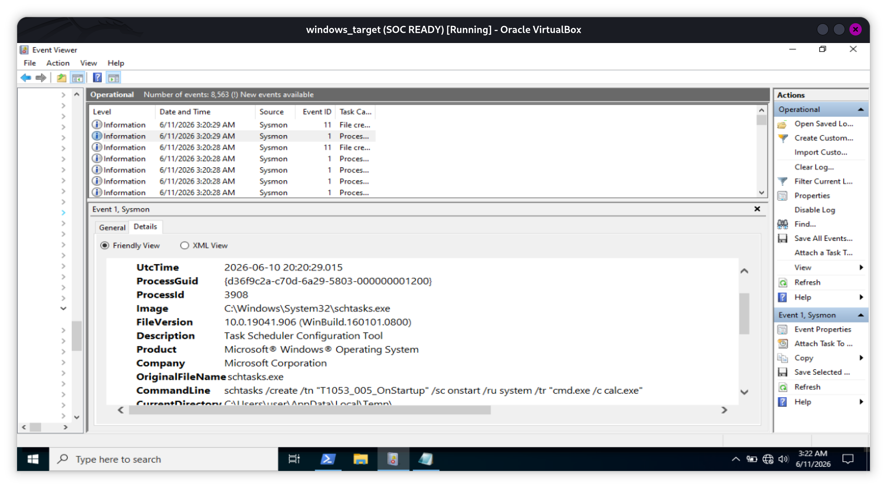

---

# Wazuh Log Collection

The Wazuh Agent successfully forwarded Sysmon telemetry to the Wazuh Manager.

Collected events included:

* Scheduled Task Creation
* Process Creation Activity
* Parent-Child Process Relationships
* Command-Line Arguments
* Host Context

The logs were normalized and indexed into OpenSearch for threat hunting and investigation.

---

# Detection Engineering

A custom Wazuh rule was created to identify Scheduled Task creation activity.

Detection focus:

* schtasks.exe execution
* Scheduled Task creation commands
* Persistence mechanisms
* Startup and Logon task registration

MITRE ATT&CK Mapping:

```xml
<rule id="100500" level="8">

    <if_group>sysmon_event1</if_group>

    <field name="win.eventdata.image">schtasks.exe</field>

    <field name="win.eventdata.commandLine">create</field>

    <description>
      Scheduled Task Created
    </description>

    <mitre>
      <id>T1053.005</id>
    </mitre>

    <group>
      attack,
      persistence,
      scheduled_task
    </group>

  </rule>

```

Generated Alert:

| Field           | Value                  |
| --------------- | ---------------------- |
| Rule ID         | 100500                 |
| Description     | Scheduled Task Created |
| MITRE Technique | T1053.005              |
| Severity        | 8                      |

---

# Threat Hunting Validation

The generated telemetry was successfully indexed into OpenSearch and became searchable through the Wazuh Dashboard.

Threat hunting activities included:

* Reviewing Scheduled Task creation events
* Inspecting command-line parameters
* Correlating parent-child processes
* Validating MITRE ATT&CK mappings

Observed fields:

* Image
* ParentImage
* CommandLine
* ParentCommandLine
* Host Information

## Screenshots

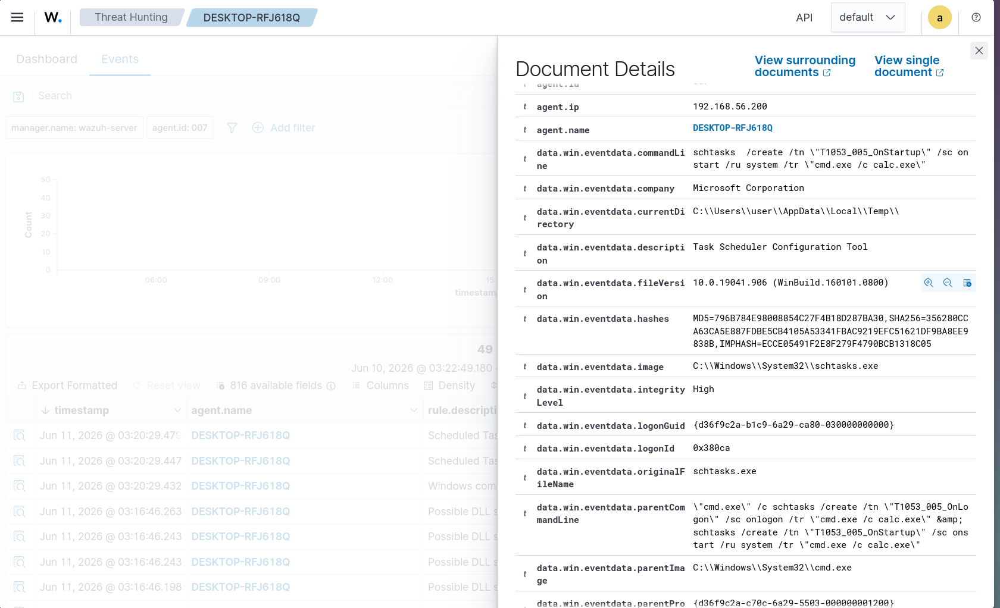

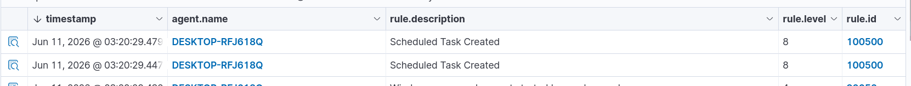

---

# True Positive Investigation

## Scenario

A Scheduled Task was created through Atomic Red Team to simulate adversary persistence behavior.

Observed Command:

```text
schtasks /create /tn "T1053_005_OnStartup" /sc onstart /ru system /tr "cmd.exe /c calc.exe"
```

### Alert Review

The Wazuh detection rule successfully generated an alert associated with Scheduled Task creation.

## Investigation Findings

### Process Analysis

| Field             | Value               |
| ----------------- | ------------------- |
| Image             | schtasks.exe        |
| Parent Process    | cmd.exe             |
| Task Name         | T1053_005_OnStartup |
| Execution Trigger | On Startup          |
| Privilege Context | SYSTEM              |

### Telemetry Validation

Sysmon Event ID 1 confirmed:

* Execution of schtasks.exe
* Creation of a Scheduled Task
* Startup persistence configuration
* Execution of cmd.exe /c calc.exe

### Analyst Assessment

The activity matched the expected behavior of the Atomic Red Team simulation.

The task naming convention and execution parameters were consistent with authorized detection validation testing.

### Verdict

**TRUE POSITIVE (Authorized Security Testing)**

### Severity

Medium

## Screenshots


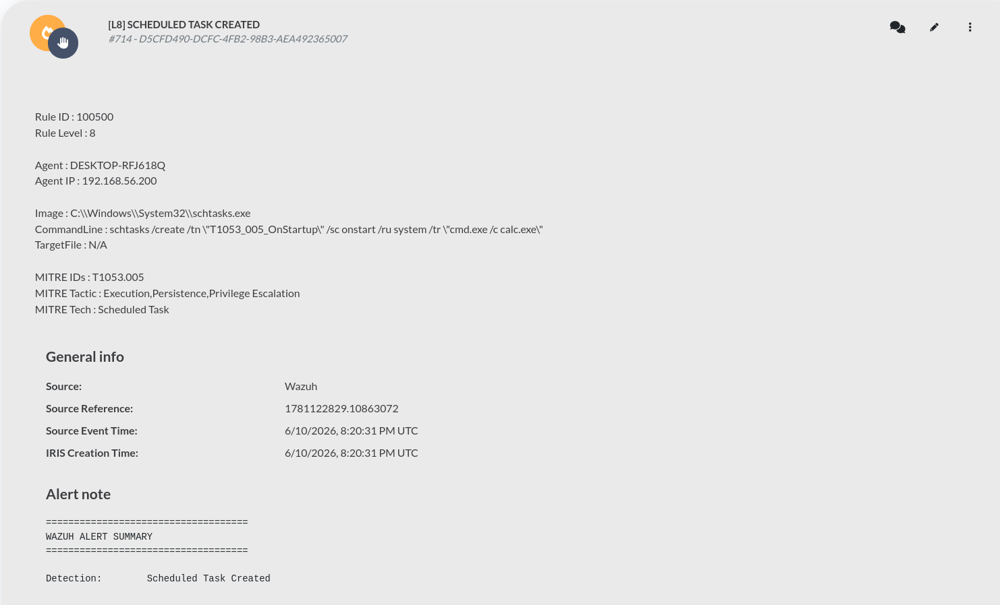

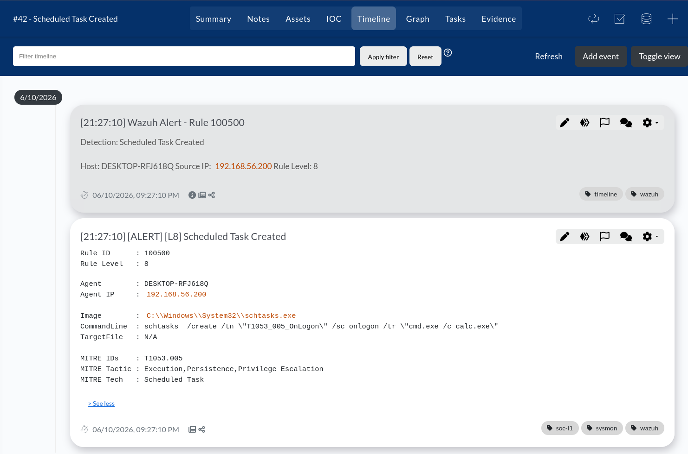

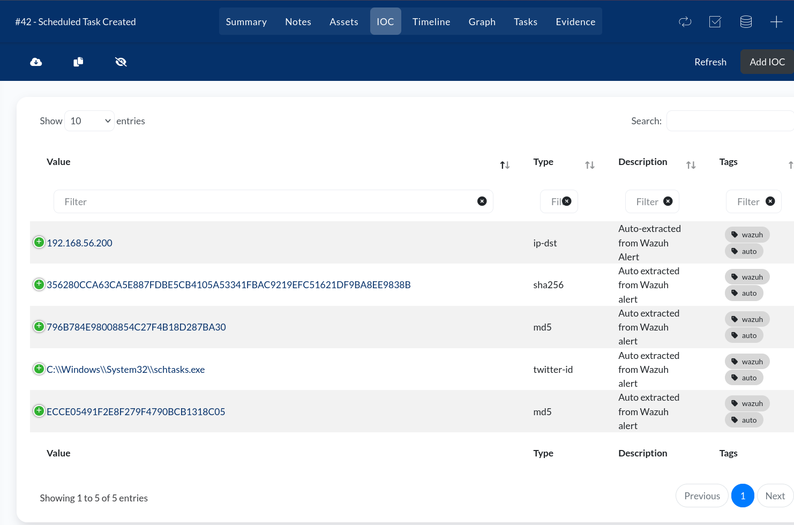

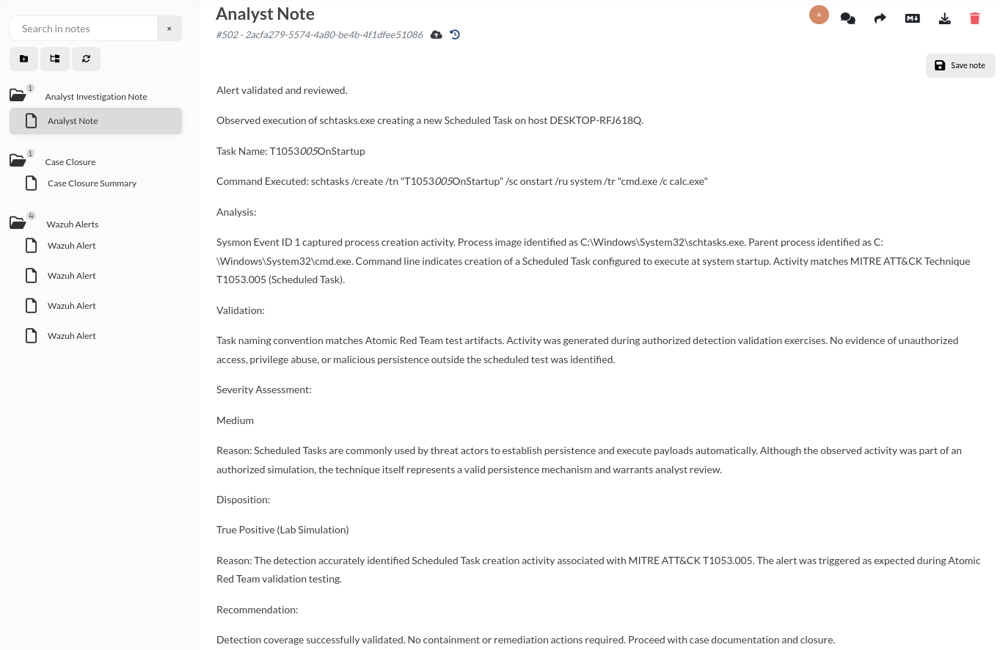

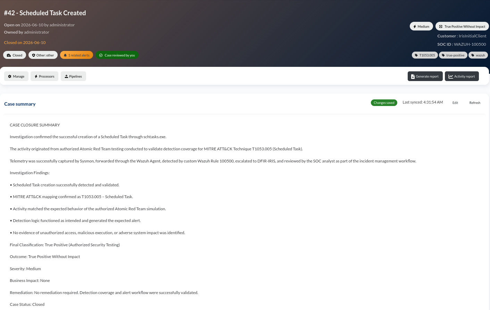

---

# False Positive Investigation

## Scenario

A legitimate administrative Scheduled Task was created for operational purposes.

Observed Command:

```text
schtasks.exe /create /tn WindowsMaintenance /tr "cmd.exe /c dir C:\ > nul" /sc daily /st 02:00
```

### Alert Review

The detection rule correctly identified Scheduled Task creation activity and generated an alert.

### Investigation Findings

### Process Analysis

| Field          | Value              |
| -------------- | ------------------ |
| Image          | schtasks.exe       |
| Parent Process | powershell.exe     |
| Task Name      | WindowsMaintenance |
| Schedule       | Daily              |
| Execution Time | 02:00              |

### Validation

The investigation confirmed:

* Activity performed by an authorized administrator
* Legitimate Microsoft binary (schtasks.exe)
* Benign command execution
* No persistence abuse
* No malicious payloads
* No indicators of compromise

### Analyst Assessment

The alert was generated because the rule detects Scheduled Task creation activity regardless of intent.

Further investigation determined the activity was a legitimate administrative operation.

### Verdict

**FALSE POSITIVE**

### Severity

Low

### Recommendation

Consider allowlisting approved administrative Scheduled Tasks or implementing task-name based exclusions to reduce alert fatigue.

## Screenshots

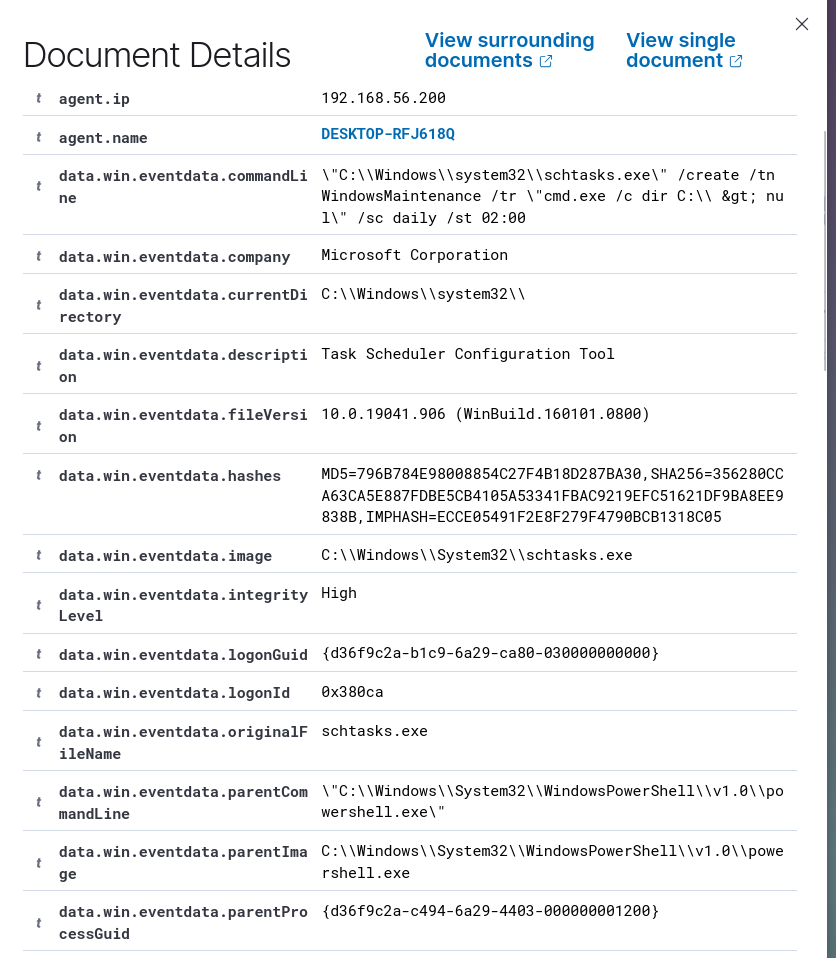

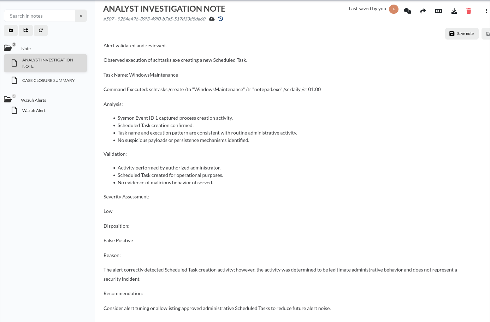

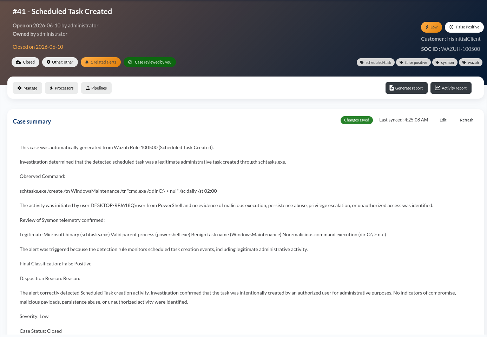

---

# Analyst Decision Matrix

| Indicator                          | True Positive | False Positive |
| ---------------------------------- | ------------- | -------------- |
| Scheduled Task Created             | ✓             | ✓              |
| schtasks.exe Execution             | ✓             | ✓              |
| Persistence Behavior               | ✓             | ✗              |
| Suspicious Task Naming             | ✓             | ✗              |
| Authorized Administrative Activity | ✗             | ✓              |
| Malicious Intent Simulation        | ✓             | ✗              |
| Benign Operational Purpose         | ✗             | ✓              |

---

# DFIR-IRIS Integration

Detected alerts were automatically escalated from Wazuh into DFIR-IRIS using a custom integration workflow.

DFIR-IRIS enabled:

* Incident Creation
* IOC Extraction
* Timeline Tracking
* Analyst Documentation
* Case Classification
* Case Closure

Incident handling activities included:

* Alert validation
* Telemetry review
* MITRE ATT&CK mapping verification
* Analyst investigation notes
* Final case disposition

The platform was used to document both True Positive and False Positive investigation outcomes.

---

# Detection Workflow Summary

1. Atomic Red Team generated Scheduled Task activity.
2. Sysmon captured endpoint process telemetry.
3. Wazuh Agent forwarded logs to Wazuh Manager.
4. Detection rules generated Scheduled Task alerts.
5. OpenSearch indexed telemetry for hunting activities.
6. Alerts were escalated into DFIR-IRIS.
7. Analyst investigation classified activity as True Positive or False Positive.
8. Cases were documented and closed.

---

# Key Takeaways

* Scheduled Tasks remain a common persistence mechanism used by threat actors.
* Sysmon Event ID 1 provides valuable visibility into Scheduled Task creation activity.
* Wazuh custom detections can effectively identify persistence-related behaviors.
* OpenSearch enables efficient threat hunting and telemetry validation.
* DFIR-IRIS helps operationalize alerts into structured investigation workflows.
* Analyst investigation is essential to differentiate True Positives from False Positives.

---

# Skills Demonstrated

* Security Monitoring
* Alert Triage
* Detection Engineering
* Threat Hunting
* Sysmon Log Analysis
* Wazuh Rule Development
* MITRE ATT&CK Mapping
* Incident Investigation
* DFIR-IRIS Case Management
* True Positive / False Positive Analysis

---

# Conclusion

This lab successfully demonstrated an end-to-end SOC workflow for detecting and investigating Scheduled Task creation activity associated with MITRE ATT&CK Technique T1053.005.

Telemetry generated from Atomic Red Team simulations and legitimate administrative activity was captured by Sysmon, analyzed by Wazuh, validated through OpenSearch, and escalated into DFIR-IRIS for incident management.

The project highlights not only detection engineering capabilities but also the analytical process required to distinguish malicious behavior from legitimate administrative operations. By incorporating both True Positive and False Positive investigations, the lab demonstrates practical SOC analyst skills that closely resemble real-world security operations.

---

# References

* MITRE ATT&CK – T1053.005 Scheduled Task
* Atomic Red Team
* Sysmon
* Wazuh Documentation
* OpenSearch Documentation
* DFIR-IRIS Documentation
